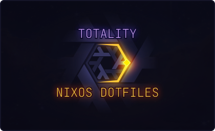

<div align="center"></div>
<div align="center" style="color: #97A1D9;">eclipsing every* system <a href="https://gitlab.com/luna-skye" style="color: #ECD974;">Luna Skye</a> touches</div><br>
<div align="center">
  <a href="https://github.com/luna-skye/dotfiles/-/commits/main"></a>
  <a href="https://gitlab.com/luna-skye/dotfiles/-/blob/main/LICENSE"></a>
  <a href="https://nixos.org"></a>
</div>
<br>

> ⚠️ DISCLAIMER<br>
> These are my *personal* dotfiles, designed for systems I oversee and work with, there is no guarantee they will work for your systems nor does this project intend to target your systems. Please fork and customize if you intend to use these dotfiles.

<br>

# Features
* ❄️ Flake Based NixOS
* 🌎 Global, modular, option-oriented configuration
* 🏡 Home Manager as a NixOS module
* 🖥️ Host specific configuration, named after moons in our solar system 🌘
  * [luna](https://pcpartpicker.com/user/DeceptiveSanctuary/saved/KyRwqs) | my main pc workstation ([Earth Moon](https://science.nasa.gov/moon/))
  * [mimas](https://www.amazon.com/HP-Pavilion-14-dw1010wm-Touch-Processor/dp/B09N9T9SLW) | my sad little laptop ([Saturn Moon](https://science.nasa.gov/saturn/moons/mimas/))
  * ariel | a near-future household system ([Uranus Moon](https://science.nasa.gov/uranus/moons/ariel/))
  * [narvi](https://pcpartpicker.com/list/mnznCd) | household relative's workstation ([Saturn Moon](https://science.nasa.gov/saturn/moons/narvi/))
* 🗑️ Automatic garbage collection & optimizations
* 🔥 Easy to use `just` commands
  * Build for current host with `just build`
  * Build for targetted host with `just build-for [hostName]`
  * Garbage collect unused nix store references with `just gc`
  * Explore Nixpkgs in Nix REPL with `just pkgs`
  * Load the Flake into Nix REPL for debugging immediately with `just repl`
  * Read the `.justfile` for more information on available commands

<br>

# Usage
## Adding New Hosts/Users
If you're installing on a fresh NixOS system, you may need to generate new host/user files and set up the respective configurations, or maybe you just want new hosts or users, our `.justfile` includes some recipes to make this faster and easier.

In a terminal, clone this repo and navigate to its directory, then run the following commands.

If the system doesn't yet have them installed, hop into a Nix shell with `just` and `nh` installed temporarily, so we can use them:
```bash
nix-shell -p just nh
```

Run the following command, replacing `<HOSTNAME>` with your system's hostname.
This will copy the host template to a new subdirectory of your `<HOSTNAME>` in the `./hosts` directory, and replace its templating values.
```bash
just new-host <HOSTNAME>
```

Next we optionally generate a new user with this command, which works in the same way.
```bash
just new-user <USERNAME>
```

Now add the new host and user to the `flake.nix` file inside the `nixosConfigurations` attribute set, toward the bottom of the file.

The `flake.nix` file includes a helper function called `mkNixosHost` which automatically registers our global modules, includes Home Manager, and sets up any users passed to it. It takes two arguments, the first being a string which is your hostname, the second is a list of strings which are the Home Manager users you want to include.
```nix
nixosConfigurations = {
  # ...
  <HOSTNAME> = mkNixosHost "<HOSTNAME>" [ "<USERNAME>" ];
};
```

Now we modify the `./hosts/<HOSTNAME>/configuration.nix` file, as this flake doesn't *yet* automatically register users in the NixOS system, only Home Manager. So navigate to and open the aforementioned file, and follow the instructions in the comment on line 13, replacing `USERNAME` with your user's name.

Finally, we can build and activate the system using a just recipe.
```bash
just build
```

## Building Configurations
There are multiple `just` recipes included to allow easy rebuilds of NixOS.

NixOS has a few actions it takes during deployment
1. Builds new generation from configuration
2. Activates the built generation, which switches your current system environment to it
3. Sets the generation as the default boot

These are the available rebuild related `just` recipes and which actions they take.
| Recipe  | Actions                          |
|---------|----------------------------------|
| `build` | Builds, activates, and sets boot |
| `test`  | Only builds and activates        |
| `dry`   | Only builds                      |

You can also check that the whole configuration evaluates successfully with the `check` recipe.

## Garbage Collection & Profile/Generation History
Nix can result in many versions of the same packages being installed, which consumes disk space. Garbage collection and management of profile/generation history can alleviate this.

Profiles are collections of system generations, while generations are the individual versioned system states from rebuilds inside a profile.

The following `just` recipes are available to help with this.
| Recipe        | Actions                                                                    |
|---------------|----------------------------------------------------------------------------|
| `history`     | Lists profile history                                                      |
| `generations` | Lists available generations                                                |
| `clean`       | Removes profiles/generations older than 7 days                             |
| `gc`          | Removes unused packages from the Nix Store and hardlinks identical entries |

## Nix REPL
The Nix REPL is a vital tool for debugging and exploring Nix code, this repo's `.justfile` includes two recipes to simplify loading things into the REPL.
| Recipe | Actions                                                               |
|--------|-----------------------------------------------------------------------|
| `pkgs` | Nix REPL with Nixpkgs loaded, useful for quick pkg searches           |
| `repl` | Nix REPL with the `flake.nix` file loaded, great for debugging config |

---
<br><br><br><br>


# Project Structure
```bash
│ ./
├─  .templates # Templates for generating new files
├─  helpers    # Custom Nix library functions
├─  hosts      # Declares each NixOS host machine
├─  modules    # Global option & configuration modules
│   ├─  apps       # Applications
│   ├─  audio      # Audio subsystems
│   ├─  cache      # Nix binary substituters/caches
│   ├─  cli        # Command-line focused software
│   ├─  fonts      # Fonts
│   ├─  gc         # Nix garbage collection
│   ├─  networking # NixOS networking
│   ├─  security   # NixOS security options and hardening
│   ├─  services   # Services (dunst, astal, tofi, etc.)
│   ├─  session    # Graphical user sessions (Hyprland, Niri, KDE Plasma)
│   └─  theme      # Custom & dynamic color palettes
└─  users      # Declares each Home-Manager user
```

Over 90% of this configuration lives within the `modules` directory. These modules expose a variety of categorized options which allow overrides either per system, or per home-manager user.
More information about each of these modules, their options, and configuration, can be found within their respective directory's `README.md` file.
